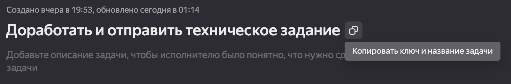

## How to
### Зависимости
Для упрощения жизни, будем пользоваться `Poetry` https://python-poetry.org

**Must have**
```shell
cd backend
poetry shell # активируем виртуальное окружение
poetry install # устанавливаем зависимости из конфигурационного файла 
poetry add <название либы> # если хотим добавить новую зависимость
```
**Useful to know**
```shell
poetry show --tree # изучаем список добавленных зависимостей
```

### Линтеры и форматтеры

Чтобы не спорить за кодстайл, будем использовать `ruff`

```shell
poetry run ruff check # запускаем проверку кодстайла
poetry run ruff check --fix # автоформаттирование
```
Если ruff не может автоматически отформаттировать код (например если длина строки > 120 символов), читаем ошибку и фиксим вручную. 
Если ошибка дурацкая и не имеет смысла (или вы считаете, что нужно сделать по-другому):
Если нужно игнорировать предупреждения для определенной строки пишем в комментарии `noqa: <id ошибки>`
```python
print(important information) # noqa: E501
```
Если нужно отключить форматирование для блока строк:
```python
# fmt: off
print(some information)
print(yet another information)
# fmt: on
```
Получаем:
```shell
All checks passed!
```

### Вмерджить изменения в main

**Шаг 1** Работа на отдельной ветке
Удостоверяемся, что мы находимся на отдельной ветке (подробнее в `git.md`)
Если нет, переключаемся вместе с изменениями на новую ветку командой
```shell
git checkout -b <имя ветки>
```

**Шаг 2** Добавление изменных файлов в индекс
```shell
git add <путь до измененного файла>
```
**Шаг 3** Коммит изменений
Чтобы изменения было удобно отслеживать, мы будем привязывать их к тикетам в трекере
Сделать это очень просто - в текст описания коммита добавляем ключ и название задачи из трекера

```shell
git commit -m "TELEGRAMBOT-8123: Доработать и отправить техническое задание"
```
**Шаг 4** Пушим ветку
```shell
git push <название ветки>
```
**Шаг 5** Создаем pull request в гитхабе
Обновляем страницу GitHub после того как запушили ветку и видим ненавязчивое предложение создать pr. Конечно же соглашаемся

**Шаг 6** ~~Мерджим изменения~~ 
Нет! Все pull request (кроме очень незначительных правок или горящих багфиксов) мы показываем коллегам

Джентельменский договор звучит так - ты можешь нажать `merge`, когда получишь как минимум 1 лайк на свой pr от коллеги. Если изменения затрагивают много частей проекта или содержат ключевые изменения, ревьюим всей командой

### Докер

TODO: