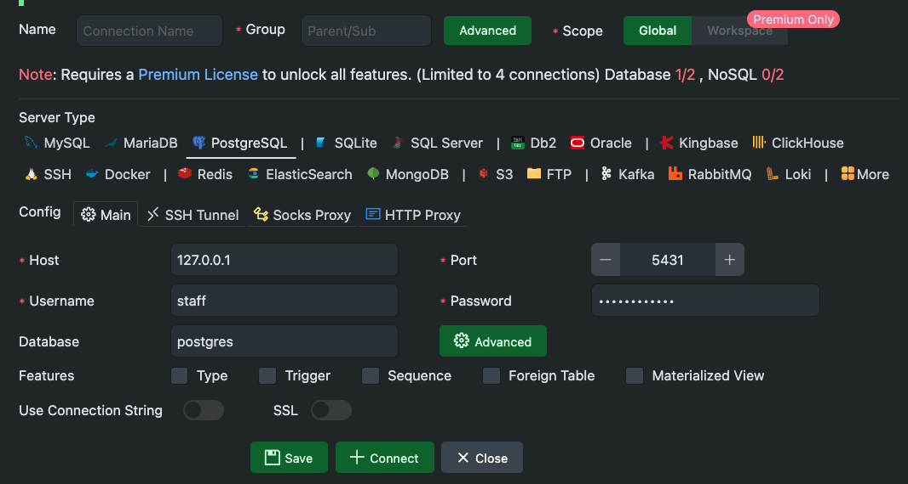
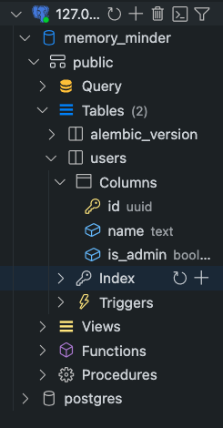
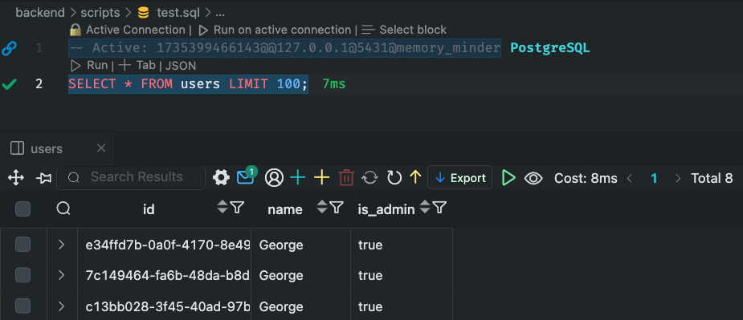
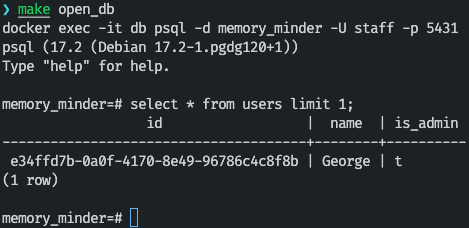

#### Поднимаем базу

```shell
cd backend

docker-compose up --build 
# или если хотим поднять только контейнер с базой
docker-compose up --build <название конейнера с базой (скорее всего db)> 
```
Или если вы просто чилловые парни

```shell
make db
```

Далее нужно применить последнюю миграцию

```shell
make migrate head
```

#### Если хотим создать свои миграции

Для любого изменения в моделях бд нужно мигрировать базу данных

```shell
make revision
```

#### Подключаемся к базе

Самый простой способ использовать расширения вашего IDE (Например `SQL Tools` в VSCode)
Алгоритм действий везде примерно одинаковый
Сначала устанавливаем активное соединение, для этого вводим имя базы, юзернейм, пароль, хост и порт. Их можно найти в `.env`

Если коннект прошел успешно, вы увидите структуры базы данных

Если этого мало и вы хотите посмотреть на содержимое таблиц, то просто создаете `sql` файл, пишете в нем интересующий запрос и выполняете на `Active connection`
Увидите что-то подобное


Если же с первым способом возникают какие-то проблемы, можно подключиться к базе данных вручную

```shell
docker exec -it <имя контейнера с бд (скорее всего db)> psql -d $(DATABASE_NAME) -U $(DATABASE_USERNAME) -p $(DATABASE_PORT)
```
Вообще переменные окружения должны подтянуться из `.env` сами, но возможно придется подставить их ручками
Иначе ту же команду можно запустить из мейкфайла
```shell
make open_db
```

Итак, мы попали в консоль postgres. Прямо сюда пишем интересующие sql-запросы


[Подробнее про работу в **psql**](https://stackoverflow.com/questions/19674456/run-postgresql-queries-from-the-command-line)

#### Хочу руками протестировать новые функции связанные с `session`

Пример с добавлением созданием и получением пользователя через _gateway_
```python
import asyncio

async def test():
    async for session in get_session():
        u_g = UserGateway()
        await u_g.add_user(session, "George", True)
        u = await u_g.get_by_name(session, name="George")
        print(u)

if __name__ == "__main__":
    asyncio.run(test())
```